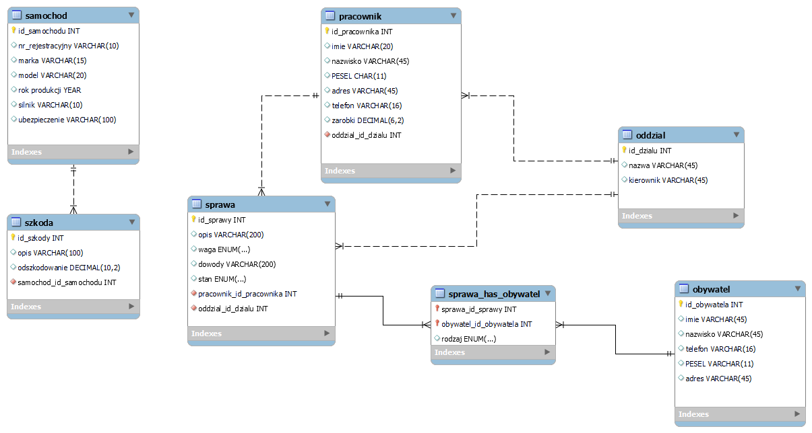

# Programowanie serwisów internetowych
Kacper Adamski, Miłosz Bandzul
# Projekt - komenda policji
Służy ochronie i utrzymaniu bezpieczeństwa i porządku publicznego.
Strona komendy umożliwia przetwarzanie danych obywateli i pracowników komendy. Możliwa jest dokumentacja przebiegu zgłoszeń i interwencji policyjnych.
Obywatele mogą zgłosić podejrzenie popełnienia przestępstwa. Policja prowadzi spis osób podejrzanych, przetwarza materiały dowodowe, spis samochodów policyjnych (i ewentualnych szkód).
# Model bazy danych

